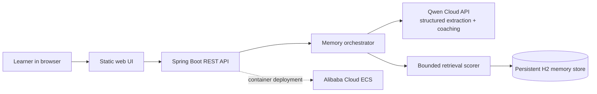

# CampusMemory

> A transparent persistent-memory learning coach powered by Qwen Cloud.

CampusMemory is a **MemoryAgent track** submission for the Qwen Cloud Global AI Hackathon. Unlike a stateless chatbot, it extracts durable learner facts, recalls only the most relevant memories in later sessions, replaces conflicting facts, expires short-lived context, and gives the learner a visible memory vault with a one-click forget control.

## Why it matters

Students repeatedly explain their goals, schedule, skill level, and recurring mistakes to generic AI assistants. CampusMemory turns those facts into a compact, inspectable memory layer so every new session starts with useful context—without hiding what was stored.

## Three-session demo

1. **Session 1:** `I am learning Java backend, preparing for an internship, and can study 1 hour per day.`
2. Click **New session**, then ask: `Plan today's study.` The UI shows the cross-session memories and their retrieval scores.
3. Say: `I can now study 2 hours per day; the old limit is outdated.` The stable `daily_study_time` key causes the one-hour memory to be superseded. The audit trail remains visible.
4. Use **Forget** to deactivate any active memory and prove that it is no longer recalled.

## Memory lifecycle

- **Extract:** Qwen structured output converts chat into typed durable facts.
- **Normalize:** stable keys identify facts that can conflict, such as `daily_study_time`.
- **Retrieve:** a bounded top-5 context uses `55% importance + 30% keyword overlap + 15% recency`.
- **Replace:** a newer value deactivates the previous value and links the audit trail.
- **Expire:** memories with a TTL are deactivated after `expiresAt`.
- **Forget:** the learner can deactivate an active memory from the UI.

## Architecture



The Qwen API is stateless. CampusMemory owns the persistent memory lifecycle and sends only the five highest-scoring active memories in each prompt.

## Run locally

Requirements: Java 17 and Maven 3.9+.

```bash
export DASHSCOPE_API_KEY="sk-your-key"
mvn spring-boot:run
```

Open `http://localhost:8080`. Without an API key, the app starts in clearly labelled **DEMO MODE** with a deterministic extractor, so reviewers can inspect the memory lifecycle. A judged Qwen Cloud run must set `DASHSCOPE_API_KEY`.

Configuration:

| Variable | Default | Purpose |
| --- | --- | --- |
| `DASHSCOPE_API_KEY` | empty | Qwen Cloud API key |
| `QWEN_BASE_URL` | `https://dashscope-intl.aliyuncs.com/compatible-mode/v1` | OpenAI-compatible Qwen endpoint |
| `QWEN_MODEL` | `qwen3.7-plus` | Qwen model ID |
| `DATA_DIR` | `./data` | Persistent H2 directory |
| `PORT` | `8080` | HTTP port |

## Run with Docker

```bash
export DASHSCOPE_API_KEY="sk-your-key"
docker compose up -d --build
curl http://localhost:8080/api/health
```

## API

- `POST /api/chat` — extract, store, retrieve, and answer.
- `GET /api/memories?userId=...` — visible memory and audit trail.
- `DELETE /api/memories/{id}?userId=...` — learner-controlled forgetting.
- `GET /api/health` — deployment smoke test and Qwen configuration status.

## Tests

```bash
mvn test
```

The integration tests verify conflicting-memory replacement, retained audit history, and manual forgetting removal from recall.

## Alibaba Cloud deployment

The production target is an Alibaba Cloud ECS instance with Docker. See [`deploy/README.md`](deploy/README.md) and the executable ECS user-data file [`deploy/aliyun-ecs-user-data.sh`](deploy/aliyun-ecs-user-data.sh). The public health URL is the final deployment smoke-test evidence.

## Privacy and safety

- The extraction prompt rejects casual chat and sensitive secrets.
- API keys are environment variables and are never stored in the repository.
- Users can inspect and forget every active memory.
- Inactive memories stay in the MVP audit view; production deployments should add configurable hard deletion and encryption at rest.

## License

MIT
