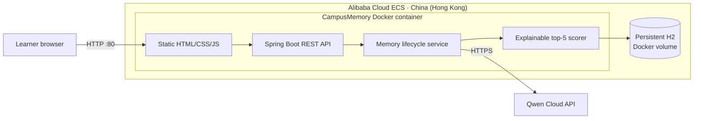

# Architecture and engineering decisions

**Submission asset:** [CampusMemory-Architecture.png](CampusMemory-Architecture.png) — 1600×900 PNG for Devpost and demo-video use.

## Deployment topology



The public surface is limited to HTTP port 80. Alibaba Cloud Session Manager provides administrative access without exposing SSH. The Qwen API key is supplied through the server-side `.env` file and is never sent to the browser or committed to Git.

## Request and memory lifecycle

```mermaid
sequenceDiagram
    participant U as Learner
    participant UI as Web UI
    participant API as Spring Boot API
    participant Q as Qwen Cloud
    participant M as Memory Service
    participant DB as Persistent H2
    U->>UI: Send message in session A
    UI->>API: POST /api/chat
    API->>Q: Extract durable facts as JSON
    Q-->>API: typed memories + stable keys
    API->>M: normalize and remember
    M->>DB: replace conflicts / persist TTL
    API->>M: retrieve top 5 for current query
    M->>DB: expire, score, and rank active memories
    DB-->>M: bounded memory context + scores
    API->>Q: coach prompt with bounded context
    Q-->>API: personalized answer
    API-->>UI: answer + used/learned memory trace
    U->>UI: Start session B
    Note over API,DB: Session ID changes; learner ID keeps durable memory
```

## Why no vector database?

The hackathon MVP optimizes for a small, explainable memory vault. Its hybrid scoring formula is visible in code and in the UI, has deterministic cost, and avoids injecting an entire user history. The repository interface can later be extended with embeddings without changing the lifecycle semantics.

## Failure behavior

- Missing API key: clearly labelled deterministic demo mode.
- Qwen extraction error: deterministic extraction preserves the demo path.
- Qwen answer error: a retry-safe error message is returned; stored memories remain intact.
- Application restart: H2 file storage is mounted to a persistent Docker volume and `WRITE_DELAY=0` makes committed memory crash-durable.
- Conflicting memory: the previous fact becomes inactive and points to the replacing memory.
